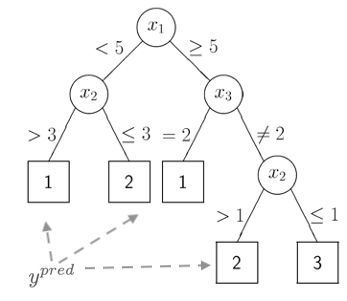
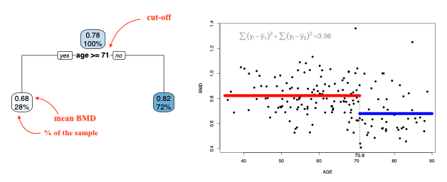

# Regression and Classification Trees

## Introduction {#RCT1}

  Decision trees can be used for continuous outcomes - *regression trees* - or
  categorical ones - *classification trees*. Classification and regression trees
  are sometimes referred as **CART**.
  
  

  The figure above represents a classification tree with several
  branches that partition the predictors
  space into disjoint regions according to some loss function.  The 
  predicted value for the outcome is found at the end of the branches.
  
 
  For **regression trees**, and similarly to the linear model, the predicted value 
  will correspond to the mean of the region created by the partition.  For a 
  classification tree, the prediction will correspond to a category of the 
  outcome. 
  

  In regression trees, a common loss function used to 
  generate the partition is:
  
  $\sum_{i \in R_1} (y_i - \bar{y}_{R_1})^2 + \sum_{i \in R_2} (y_i - \bar{y}_{R_2})^2$
  
  where $\bar{y}_{R_1}$ and $\bar{y}_{R_2}$ are the means of the outcome for
  the regions created by splitting the region defined by a predictor into 2 
  parts.  
  
  
  
  
  The animation below shows different splits of
  the predictor and the correspondent prediction (mean of $y$) - the two
  horizontal lines represent to the mean of the outcome
  in the two regions.  The change in the loss function is computed in the top
  left corner:

  

  
 At each step, the predictor and respective cutoff that minimise the loss 
 function is selected to split the branch. 
 
   
  
   
We can keep dividing the branches until each region has 1 data 
point (there can be more if there are ties).  This of course will result in 
the tree overfitting the data.  We would prefer a smaller tree that would 
result in a lower MSE.  Cutting the branches of the tree to reduce its 
complexity and potentially leading to an improvement in the MSE is called
*pruning*.

Once again we will use the idea of penalisation to balance complexity and 
fitting. 

\[
\sum_{m=1}^{|T|} \sum_{x_i \in R_m} (y_i - \bar{y}_{R_m})^2 + \alpha |T|, \\
|T| \text{ is the number of nodes in the tree}
\]

The penalisation (tuning) parameter, $\alpha$, controls the amount of pruning
and it can be chosen by cross-validation.
  

**Classification trees** follow a similar logic but the outcome is categorical.
We will have to consider a different loss function. Two common loss functions 
used in classification trees are:

*Gini index*: $1-\sum_{k=1}^K{p_k^2}$

  * Favours larger partitions.
  * Perfectly classified, Gini Index would be zero.
  * Evenly distributed would be 1 – (1/# Classes).

*Information gain (entropy):* $\sum_{k=1}^K{-p_k\log_2 p_k}$

  * Favours splits with small counts but many unique values
  * Weights probability of class by log2 of the class probability
  * Information Gain is the entropy of the parent node minus the entropy of the child nodes.


<iframe width="784" height="441"  src="https://www.youtube.com/embed/7kWRogpXF2E" frameborder="0" allow="accelerometer; autoplay; clipboard-write; encrypted-media; gyroscope; picture-in-picture" allowfullscreen></iframe>


  
## Readings {#CART2}

Read the following chapters of *An introduction to statistical learning*: 

* 8.1 The Basics of Decisions Trees
* [An Introduction to Recursive Partitioning Using the RPART Routines](https://cran.r-project.org/web/packages/rpart/vignettes/longintro.pdf) - extra 
notes


## Practice session {#CART3}


### Task 1 - Grow a complete regression tree {-}

Using the BMD.csv dataset,

Using the [bmd.csv](https://www.dropbox.com/s/7wjsfdaf0wt2kg2/bmd.csv?dl=1),
fit a tree to predict bone mineral density (BMD) 
based on AGE

```{r message = FALSE}
#libraries that we will need
set.seed(1974) #fix the random generator seed 
```

```{r}
library(rpart)  #library for CART
library(rpart.plot)
#read the dataset
bmd.data     <- 
  read.csv("https://www.dropbox.com/s/c6mhgatkotuze8o/bmd.csv?dl=1", 
           stringsAsFactors = TRUE)
```

The package `rpart` implements the classification and regression trees and the
`rpart.plot` contains the tree plotting function. We will use the `rpart()` 
function to fit the tree, with some options to grow the complete tree

```{r}
library(caret)
t1 <- rpart(bmd ~ age,
            data = bmd.data, 
            method = "anova",         #indicates the outcome is continuous
            control = rpart.control(
                       minsplit = 1,  # min number of observ for a split 
                       minbucket = 1, # min nr of obs in terminal nodes
                       cp=0)          #decrease in complex for a split 
)

#the rpart.plot() may take a long time to plot
#the complete tree
#if you cannot run it, just try plot(t1); text(t1, pretty=1)
#and you will see just the structure of the tree
rpart.plot(t1)     
```


We can now prune the tree using  a limit for the complexity parameter $cp$. 
This will indicate that only a split with CP higher than the limit is worth it.

```{r}
printcp(t1)                      #CP for the complete tree
prune.t1 <- prune(t1, cp=0.02)   #prune the tree with cp=0.02

printcp(prune.t1)

rpart.plot(prune.t1)              #pruned tree   
```

**TRY IT YOURSELF:**

1) Get a tree for the problem above but with the defaults of `rpart.control()`.

<details><summary>See the solution code</summary>

```{r, results="hide"}
?rpart.control     #see the defaults
t1.default <- rpart(bmd ~ age,
                    data = bmd.data,  
                    method = "anova") 
rpart.plot(t1.default)

```

</details><p><p>

2) Use the `caret` package to fit the `prune.t1` tree

<details><summary>See the solution code</summary>

```{r, results="hide"}
trctrl <- trainControl(method = "cv", number  = 10)

#to get the same tree we will fix the tuning parameter cp
#to be 0.02
t1.caret  <-  train(bmd ~ age, 
                        data = bmd.data, 
                        method = "rpart",
                        trControl=trctrl,
                        control = rpart.control(minsplit = 1, 
                                                minbucket = 1, 
                                                cp=0.02),
                        tuneGrid = expand.grid(cp=0.02))

rpart.plot(t1.caret$finalModel)
```

</details><p><p>

### Task 2 - Make predictions from a tree {-}

Let's use the pruned tree from task 1 (`pruned.t1`) to predict the BMD for an 
individual 70 years old and compare it with the predictions from a linear 
model

```{r, results="hide"}
lm1 <- lm(bmd ~ age,
           data = bmd.data)

predict(prune.t1,                       #prediction using the tree
        newdata = data.frame(age=70))

predict(lm1,                           #prediction using the linear model
        newdata = data.frame(age=70))

```

We now want to plot the predictions from the tree for ages 40 through 90 
together with the predictions from the linear model


```{r, results="hide"}

pred.tree <- predict(prune.t1,                      
                     newdata = data.frame(age=seq(40,90,1)))

pred.lm   <-predict(lm1,                          
                     newdata = data.frame(age=seq(40,90,1)))

plot(seq(40,90,1), pred.tree , 
     type = "l", col="blue", 
     xlab="age", ylab="bmd")

lines(seq(40,90,1), pred.lm, col="red")

legend(45, 1.2, lty=c(1,1), 
       c("tree", "linear model"), 
       col=c("blue","red"))

```


### Task 3 - Fit a tree using Cross-validation {-}

Let's fit now a tree to predict bone mineral density (BMD) based on AGE, 
SEX and BMI (BMI has to be computed) and compute the MSE.

We will use the `caret` package with `method="rpart"`.  Notice that the
`caret` will prune the tree based on the cross-validated `cp`. 


```{r}
#compute BMI
bmd.data$bmi <- bmd.data$weight_kg / (bmd.data$height_cm/100)^2

trctrl <- trainControl(method = "repeatedcv", number = 10, repeats = 10)
t2.caret  <-  train(bmd ~ age + sex + bmi, 
                        data = bmd.data, 
                        method = "rpart",
                        trControl=trctrl,
                        tuneGrid = expand.grid(cp=seq(0.001, 0.1, 0.001))
                        )

#Plot the RMSE versus the CP
plot(t2.caret)

#Plot the tree with the optimal CP
rpart.plot(t2.caret$finalModel)

t2.caret$finalModel$cptable
```

We can compare the RMSE and R2 of the tree above with the linear model

```{r}
trctrl <- trainControl(method = "repeatedcv", number = 5, repeats = 10)
lm2.caret<-  train(bmd ~ age + sex + bmi, 
                        data = bmd.data, 
                        method = "lm",
                        trControl=trctrl
                        )

lm2.caret$results
#extracts the row with the RMSE and R2 from the table of results
#corresponding to the cp with lowest RMSE  (best tune)
t2.caret$results[t2.caret$results$cp==t2.caret$bestTune[1,1], ]
```


### Task 4 - Fit a classification tree {-}


The [SBI.csv](https://www.dropbox.com/s/da3by5vuzkv77xi/SBI.csv?dl=1) dataset
contains the information of more than 2300 children that attended the 
emergency services with fever and were tested for serious bacterial infection.
The variable  **sbi** has 
4 categories: Not Applicable(no infection) / UTI / Pneum / Bact


Create a new variable sbi.bin that identifies if a child was diagnosed 
or not with serious bacterial infection.

```{r}
set.seed(1999)
sbi.data <- read.csv("https://www.dropbox.com/s/wg32uj43fsy9yvd/SBI.csv?dl=1")
summary(sbi.data)

# Create a binary variable based on "sbi"
sbi.data$sbi.bin <- as.factor(ifelse(sbi.data$sbi == "NotApplicable", "NOSBI", "SBI"))
table(sbi.data$sbi, sbi.data$sbi.bin)
#sbi.data.sub <- sbi.data[,c("sbi.bin","fever_hours","age","sex","wcc","prevAB","pct","crp")]
```

Now, build a classification tree to predict if a child has serious bacterial
infection using **fever_hours**, **wcc**, **age**, **prevAB**, **pct**,  and **crp**


```{r}
sbi.tree <- rpart(sbi.bin ~ fever_hours+age+sex+wcc+prevAB+pct+crp,
                  data = sbi.data,
                  method = "class"
                  )

plotcp(sbi.tree)
```

Looking at the error associated with different values of *CP* using the default
options, it is not
clear that we have the range that gives us the lowest error.  We will use
`part.control` to extend the tree and then prune it.

```{r}
sbi.tree <- rpart(sbi.bin ~ fever_hours+age+sex+wcc+prevAB+pct+crp,
                  data = sbi.data,
                  method = "class",
                  control = rpart.control(
                       minsplit = 5,  # min number of observ for a split 
                       minbucket = 5, # min nr of obs in terminal nodes
                       cp=0.001)   
                  )

plotcp(sbi.tree)
printcp(sbi.tree)
```

If you have the same `set.seed(1999)` you should get `cp = 0.0050336` as the
one with lowest error.  We can now prune the tree accordingly.

```{r}
sbi.prune.tree <- prune(sbi.tree, cp = 0.0050336)
rpart.plot(sbi.prune.tree)
```


**TRY IT YOURSELF:**

1) Use the `caret` package to fit the tree above.


<details><summary>See the solution code</summary>

```{r, results="hide"}
trctrl      <- trainControl(method = "repeatedcv", 
                            number = 5, 
                            repeats = 10,
                             classProbs = TRUE,  
                            summaryFunction = twoClassSummary)

tree.sbi    <- train(sbi.bin ~ fever_hours+age+sex+wcc+prevAB+pct+crp,
                            data = sbi.data,
                            method = "rpart",
                            trControl = trctrl,
                            tuneGrid=expand.grid(cp=seq(.001, .1, .001)))

tree.sbi
tree.sbi$finalModel
rpart.plot(tree.sbi$finalModel)

```

</details><p><p>


2) Compare the confusion matrix of the trees fitted with `rpart()` function
and the `caret` package.


```{r, results="hide"}
Pred1 <- predict(sbi.prune.tree, sbi.data, type = "class" )
Pred2 <- predict(tree.sbi, sbi.data)

table(sbi.data$sbi.bin, Pred1)
table(sbi.data$sbi.bin, Pred2)

library(psych)
cohen.kappa(table(sbi.data$sbi.bin, Pred1))
cohen.kappa(table(sbi.data$sbi.bin, Pred2))
```


## Exercises {#CART4}

Solve the following exercises:

1) The dataset [SA_heart.csv](https://www.dropbox.com/s/cwkw3p91zyizcqz/SA_heart.csv?dl=1)
contains on coronary heart disease status (variable *chd*) and several risk
factors including the cumulative tobacco consumption *tobacco*, systolic *sbp*, 
and *age*

  a) Fit a classification tree for *chd* using
  *tobacco*,*sbp* and *age* 

  b) Find the AUC ROC and confusion matrix for the tree
  
  c) What is the predicted probability of coronary heart disease for someone
  with no tobacco consumption, sbp=132 and 45 years old?
  
  

2) The dataset [fev.csv](https://www.dropbox.com/s/jeqdtq04zl9f0er/FEV.csv?dl=1) 
contains the measurements of forced expiratory volume (FEV) tests, 
evaluating the pulmonary capacity in 654 children and young adults. 

  a) Fit a regression tree to predict *fev* using *age*, *height* and *sex*.
  
  b) Compare the MSE of the tree with a GAM model for *fev* with *sex* and 
  smoothing   splines for *height* and *age*.
  
 