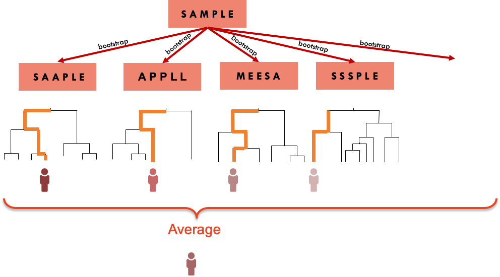

# Bagging

## Introduction {#BA1}

Trees are quite flexible leading to non biased prediction, and intuitive to 
interpret. However, they tend to have a high variance, meaning that a small 
change in the data may result in a different tree.

**Bagging** is an approach that tries to "stabilise" the predictions from trees.
Rather that fitting a single tree to the data, we will bootstrap the data and
for each bootstrap sample, we will fit a tree.  The final prediction is an 
average of all the predictions of the trees, if the outcome is continuous, or
the class that was most common among the predictions, if the outcome is 
categorical




The downside of this approach is that we lose the interpretability of a 
single tree.  The result is a prediction from what in machine learning is 
sometimes referred as a *black box* method.

We can however use the multiple trees to create a metric of variable importance.
The idea is that a variable that appears early in many trees is "more" 
important than a predictor that consistently appears further down in the trees.


<iframe width="784" height="441"  src="https://www.youtube.com/embed/8YtkBDV5Xq4" frameborder="0" allow="accelerometer; autoplay; clipboard-write; encrypted-media; gyroscope; picture-in-picture" allowfullscreen></iframe>


## Readings {#BA2}

Read the following chapters of *An introduction to statistical learning*: 

* 8.2.1 Bagging


## Practice session {#BA3}


### Task 1 - Use bagging to build a classification model {-}


The [SBI.csv](https://www.dropbox.com/s/da3by5vuzkv77xi/SBI.csv?dl=1) dataset
contains the information of more than 2300 children that attended the 
emergency services with fever and were tested for serious bacterial infection.
The variable  **sbi** has 
4 categories: Not Applicable(no infection) / UTI / Pneum / Bact


Create a new variable sbi.bin that identifies if a child was diagnosed 
or not with serious bacterial infection.

```{r}
sbi.data <- read.csv("https://www.dropbox.com/s/wg32uj43fsy9yvd/SBI.csv?dl=1")
summary(sbi.data)

# Create a binary variable based on "sbi"
sbi.data$sbi.bin <- as.factor(ifelse(sbi.data$sbi == "NotApplicable", "NOSBI", "SBI"))
table(sbi.data$sbi, sbi.data$sbi.bin)
#sbi.data.sub <- sbi.data[,c("sbi.bin","fever_hours","age","sex","wcc","prevAB","pct","crp")]
```


Now, let's using bagging to predict if a child has serious bacterial
infection with the perdictors **fever_hours**, **wcc**, **age**, **prevAB**, 
**pct**, and **crp**.

However, we will leave 200 observations out to test the model. We will 
use the `bagging()` function from the `ipred` package and fit 100 trees.

```{r}
library(caret)
library(ipred)  #includes the bagging function 
library(rpart)
library(psych) # for the kappa statistics
set.seed(1999)

sbi.bag <- bagging(sbi.bin ~ fever_hours+age+sex+wcc+prevAB+pct+crp,
                  data = sbi.data[-c(500:700),],      #not using rows 500 to 700
                  nbagg=100)
```

We will also fit one single tree to use as a comparison.

```{r}
sbi.tree <- rpart(sbi.bin ~ fever_hours+age+sex+wcc+prevAB+pct+crp,
                  data = sbi.data[-c(500:700),], method="class", 
                  control = rpart.control(cp=.001))
printcp(sbi.tree)
sbi.tree <- prune(sbi.tree, cp=0.008016)
```

We can now compute the confusion matrix for both approaches, using the 
200 cases left out from the model fitting.

```{r}
sbi.test.data <- sbi.data[c(500:700),]

#confusion matrix for 1 tree
table(sbi.test.data$sbi.bin, 
    predict(sbi.tree, sbi.test.data, type="class"))
cohen.kappa(table(sbi.test.data$sbi.bin, 
    predict(sbi.tree, sbi.test.data, type="class")))

#confusion matrix for bagged trees
table(sbi.test.data$sbi.bin, 
      predict(sbi.bag, sbi.test.data, type="class"))

cohen.kappa(table(sbi.test.data$sbi.bin, 
      predict(sbi.bag, sbi.test.data, type="class")))
```

The *bagging* improved the prediction ability.


**TRY IT YOURSELF:**

1) Use the `caret` package to fit the model above with bagging. You can use
the entire dataset and compute the cross-validated AUC-ROC and confusion matrix


<details><summary>See the solution code</summary>

```{r, results="hide"}
set.seed(1777)
trctrl      <- trainControl(method = "repeatedcv", 
                            number = 10,
                             classProbs = TRUE,  
                            summaryFunction = twoClassSummary)

bag.sbi    <- train(sbi.bin ~ fever_hours+age+sex+wcc+prevAB+pct+crp,
                            data = sbi.data,
                            method = "treebag",
                            trControl = trctrl,
                            nbagg = 100,
                            metric="ROC")
bag.sbi
confusionMatrix(bag.sbi)
```

</details><p><p>


### Task 2 - Compute the variable importance {-}

Let's compute the variable importance based on the `sbi.bag` bagging model.
The function `varImp()` from the `caret` package, can be applied to the 
result of the `bagging()` function

```{r, results="hide"}
pred.imp <- varImp(sbi.bag)
pred.imp

#You can also plot the results
barplot(pred.imp$Overall, 
        names.arg = row.names(pred.imp))

#If you use the caret package
#to fit the model, you can use the ggplot() to create an alternative plot

library(ggplot2)
pred.imp.caret <- varImp(bag.sbi)
ggplot(pred.imp.caret) #This is a standard ggplot object which can be edited in the usual way
``` 


## Exercises {#BA4}


Solve the following exercises:

1) The dataset [SA_heart.csv](https://www.dropbox.com/s/cwkw3p91zyizcqz/SA_heart.csv?dl=1)
contains on coronary heart disease status (variable *chd*) and several risk
factors including the cumulative tobacco consumption *tobacco*, systolic *sbp*, 
and *age*

  a) Build a predictive model by bagging 100 tree to classify *chd* using
  *tobacco*,*sbp* and *age* 

  b) Find the cross-validated AUC ROC and confusion matrix for the model above
  and compare them with ones obtained from logistic regression.
  
  c) Which is the most important predictor?
  
  d) What is the predicted probability of coronary heart disease for someone
  with no tobacco consumption, sbp=132 and 45 years old?
  
  

2) The dataset [fev.csv](https://www.dropbox.com/s/jeqdtq04zl9f0er/FEV.csv?dl=1) 
contains the measurements of forced expiratory volume (FEV) tests, 
evaluating the pulmonary capacity in 654 children and young adults. 

  a) Fit a model based on bagging 200 tree to predict *fev* using 
  *age*, *height* and *sex*.
  
  b) Plot the variables importance.
  
  c) Compare the MSE of the model above with a GAM model for *fev* with *sex* and 
  smoothing splines for *height* and *age*.
    
  

