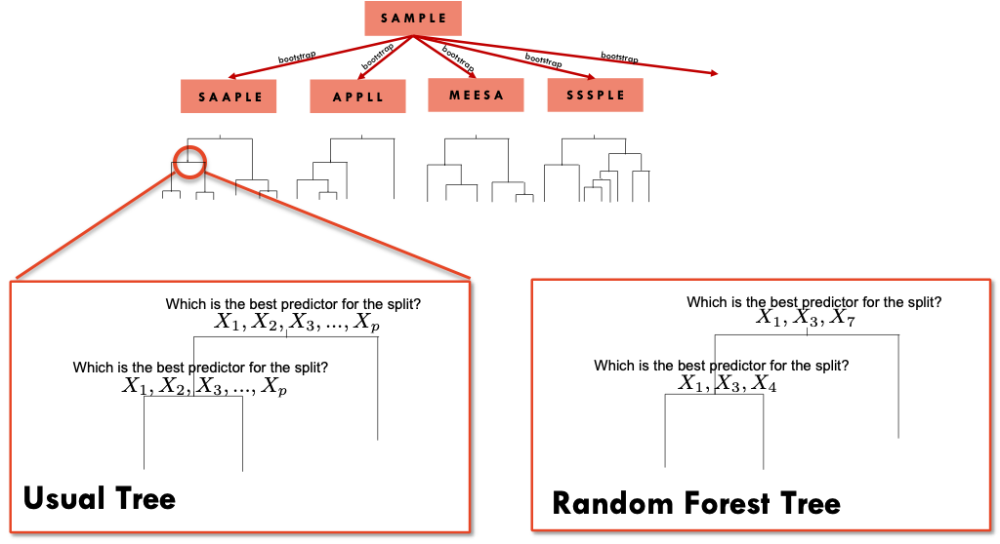

# Random Forests

## Introduction {#RF1}

We have seen that **bagging** pools together the results of different trees
based on bootstrap samples.  These trees will tend to be highly correlated. 
**Random forests** use a the same principle of bagged trees but with a 
difference in the construction of each tree.  When growing a tree from one 
bootstrap sample, instead of evaluating all the predictors when deciding to
split a node, **Random forests** only use a subset of the predictors
randomly selected.




So, let's say that we have $p$ predictors and rather than evaluating all the
predictors at each knot, we select, for example 3 random predictors at each
knot. Notice that the next knot will evaluate 3 different random predictors (
unless, we get the same 3 by chance).  This will uncorrelated the trees and
produce better predictions.

We can choose not only the number of trees but also the number of variables
that will be considered at each node.  A recommended option is to select
$\sqrt(p)$ variables from the $p$ predictors in a classification problem, and 
$p/3$ in a regression problem.

<iframe width="784" height="441" src="https://www.youtube.com/embed/x9SPsBYiT-I" frameborder="0" allow="accelerometer; autoplay; clipboard-write; encrypted-media; gyroscope; picture-in-picture" allowfullscreen></iframe>

## Readings {#RF}

Read the following chapters of *An introduction to statistical learning*: 

* 8.2.2 Random Forests


## Practice session {#RF3}


### Task 1 - Build a Random Forest model {-}


The [SBI.csv](https://www.dropbox.com/s/jg628ezqo79pn3y/SBI.csv?dl=0) dataset
contains the information of more than 2300 children that attended the 
emergency services with fever and were tested for serious bacterial infection.
The variable  **sbi** has 
4 categories: Not Applicable(no infection) / UTI / Pneum / Bact

Create a new variable sbi.bin that identifies if a child was diagnosed 
or not with serious bacterial infection.

```{r}
sbi.data <- read.csv("https://www.dropbox.com/s/wg32uj43fsy9yvd/SBI.csv?dl=1")
summary(sbi.data)

# Create a binary variable based on "sbi"
sbi.data$sbi.bin <- as.factor(ifelse(sbi.data$sbi == "NotApplicable", "NOSBI", "SBI"))
table(sbi.data$sbi, sbi.data$sbi.bin)
#sbi.data.sub <- sbi.data[,c("sbi.bin","fever_hours","age","sex","wcc","prevAB","pct","crp")]
```


Now, let's using a Random Forest to predict if a child has serious bacterial
infection with the predictors **fever_hours**, **wcc**, **age**, **prevAB**, 
**pct**, and **crp**.

However, we will leave 200 observations out to test the model. We will 
use the `randomForest()` function from the `randomForest` package and fit 
100 trees with 2 predictors at each node ($\sqrt(7)=2.6$)

```{r}
library(caret)
library(randomForest)  #includes the randomForest function 
library(rpart)
library(psych) # for the kappa statistics
set.seed(1999)

rf.sbi <- randomForest(sbi.bin ~ fever_hours+age+sex+wcc+prevAB+pct+crp,
                  data = sbi.data[-c(500:700),],      #not using rows 500 to 700
                  ntree=100, mtry=2)
```

We will also fit one single tree to use as a comparison.

```{r}
sbi.tree <- rpart(sbi.bin ~ fever_hours+age+sex+wcc+prevAB+pct+crp,
                  data = sbi.data[-c(500:700),], method="class", 
                  control = rpart.control(cp=.001))
printcp(sbi.tree)
sbi.tree <- prune(sbi.tree, cp=0.008016)
```

We can now compute the confusion matrix for both approaches, using the 
200 cases left out from the model fitting.

```{r}
sbi.test.data <- sbi.data[c(500:700),]

#confusion matrix for 1 tree
table(sbi.test.data$sbi.bin, 
    predict(sbi.tree, sbi.test.data, type="class"))
cohen.kappa(table(sbi.test.data$sbi.bin, 
    predict(sbi.tree, sbi.test.data, type="class")))

#confusion matrix for RF
table(sbi.test.data$sbi.bin, 
      predict(rf.sbi, sbi.test.data, type="class"))

cohen.kappa(table(sbi.test.data$sbi.bin, 
      predict(rf.sbi, sbi.test.data, type="class")))
```

The *random forest* has a better prediction ability.


**TRY IT YOURSELF:**

1) Use the `caret` package to fit the model above. You can use
the entire dataset and compute the cross-validated AUC-ROC and confusion matrix


<details><summary>See the solution code</summary>

```{r, results="hide"}
set.seed(1777)
library(caret)
trctrl      <- trainControl(method = "repeatedcv", 
                            number = 10,
                            repeats = 5,
                             classProbs = TRUE,  
                            summaryFunction = twoClassSummary)

sbi.rf    <- train(sbi.bin ~ fever_hours+age+sex+wcc+prevAB+pct+crp,
                            data = sbi.data,
                            method = "rf",
                            trControl = trctrl,
                            ntree = 100,
                            tuneGrid = expand.grid(mtry = sqrt(7)),
                            metric="ROC")
sbi.rf
confusionMatrix(sbi.rf)
```

</details><p><p>


### Task 2 - Compute the variables importance {-}

Let's compute the variable importance based on the `rf.sbi` random forest model.

```{r, results="hide"}
pred.imp <- varImp(rf.sbi)
pred.imp

#You can also plot the results
barplot(pred.imp$Overall, 
        names.arg = row.names(pred.imp))

#If you use the caret package to fit the model, you can use the ggplot() to create an alternative plot

library(ggplot2)
pred.imp.caret <- varImp(sbi.rf)
ggplot(pred.imp.caret) #This is a standard ggplot object which can be edited in the usual way
``` 


## Exercises {#RF4}

Solve the following exercises:

1) The dataset [SA_heart.csv](https://www.dropbox.com/s/cwkw3p91zyizcqz/SA_heart.csv?dl=1)
contains on coronary heart disease status (variable *chd*) and several risk
factors including the cumulative tobacco consumption *tobacco*, systolic *sbp*, 
and *age*

  a) Build a predictive model using a random forest with 100 trees to classify
  *chd* using
  *tobacco*,*sbp* and *age* 

  b) Find the cross-validated AUC ROC and confusion matrix for the model above
  and compare them with ones obtained from logistic regression and bagging.
  
  c) Which is the most important predictor?
  
  d) What is the predicted probability of coronary heart disease for someone
  with no tobacco consumption, sbp=132 and 45 years old?
  
  

2) The dataset [fev.csv](https://www.dropbox.com/s/jeqdtq04zl9f0er/FEV.csv?dl=1) 
contains the measurements of forced expiratory volume (FEV) tests, 
evaluating the pulmonary capacity in 654 children and young adults. 

  a) Fit a model based on random forest with 200 tree to predict *fev* using 
  *age*, *height* and *sex*.
  
  b) Plot the variables importance.
  
  c) Compare the MSE of the model above with a GAM model for *fev* with *sex* 
  and smoothing splines for *height* and *age*.
    
  

