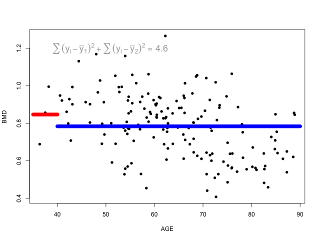

--- 
title: "Machine Learning for Biostatistics"
subtitle: "Module 6"
author: "Armando Teixeira-Pinto & Jaroslaw Harezlak"
date: "`r Sys.Date()`"
site: bookdown::bookdown_site
documentclass: book
link-citations: yes

#bookdown::render_book("index.rmd")
# When compiling for *pdf the animated gif tree.gif in chapter 1 causes
#an error. Delete the line  and compile first with:
  #bookdown::render_book("index.rmd", "all")
#then add it again and compile with:
  #bookdown::render_book("index.Rmd")
#bookdown::publish_book(account="andrew_grant")
---

# Beyond Additivity {-}

```{r setup, include=FALSE}
knitr::opts_chunk$set(echo = TRUE)
```


## Introduction {-}

So far, most of the methods that we have seen (with the exception of KNN) assume
an additive effect of the predictors.  We will now study non-parametric methods 
to estimate $f(\mathbf x)$.

By the end of this module you should be able to:

1. Construct regression and classification trees
2. Use cross-validation to prune a tree
3. Understand the advantages and disadvantages of trees
4. Define bagging and boosting
5. Fit random forests

##  Dataset used in the examples {-}  

The dataset **triceps** is available in the `MultiKink` package.
You may `install.packages("MultiKink")`, load the library (`library(MultiKink)`)
and then run `data("triceps")`. 

The data are derived from an anthropometric study of 892 females under 50 years
in three Gambian villages in West Africa. There are 892 observations 
on the following 3 variables: 

* age - Age of respondents.
* lntriceps - Log of the triceps skinfold thickness.
* triceps - Triceps skinfold thickness.


<p> </p>
***

The data [SA_heart.csv](https://www.dropbox.com/s/cwkw3p91zyizcqz/SA_heart.csv?dl=1)
is retrospective sample of males in a heart-disease high-risk region of the 
Western Cape, South Africa. There are roughly two controls per case of CHD. 

Many of the CHD positive men have undergone blood pressure 
reduction treatment and other programs to reduce their risk factors after 
their CHD event. In some cases the measurements were made after these 
treatments. These data are taken from a larger dataset, 
described in Rousseauw et al, 1983, South African Medical Journal.

The data contains  462 observations on the following 10 variables.

* sbp - systolic blood pressure
* tobacco - cumulative tobacco (kg)
* ldl - low density lipoprotein cholesterol
* adiposity - a numeric vector
* famhist - family history of heart disease, a factor
with levels Absent Present
* typea - type-A behavior
* obesity - a numeric vector
* alcohol - current alcohol consumption
* age - age at onset
* chd- response, coronary heart disease (1 - chd, 0 - no chd)

<p> </p>
***

The file [SBI.csv](https://www.dropbox.com/s/da3by5vuzkv77xi/SBI.csv?dl=1) 
contains 2349 records of children admitted to the emergency room
with fever and tested for serious bacterial infection (**sbi**). The following 
variables are included :

* id – patient’s number
* fever_hours – duration of the fever in hours
* age – child’s age
* sex – child’s sex (M / F)
* wcc – white cell count
* prevAB – previous antibiotics (Yes / No)
* sbi – serious bacterial infection (Not Applicable / UTI / Pneum / Bact)
* pct – procalcitonin
* crp – c-reactive protein

<p> </p>
***


##  Slides from the videos {-}

You can download the slides used in the videos form Beyond Additivity:

[Slides](https://www.dropbox.com/s/tknv7nbtetstth3/Module-6-Beyond-Additivity_2020.pdf?dl=1)
